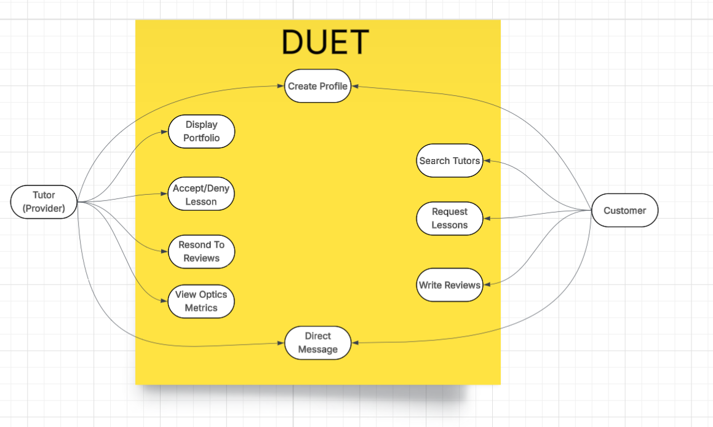

# Duet - Software Design 

Version 1  
Prepared by Brian Tekmen\
Duet\
Oct 20, 2025

Table of Contents
=================
* [Revision History](#revision-history)
* 1 [Product Overview](#1-product-overview)
* 2 [Use Cases](#2-use-cases)
  * 2.1 [Use Case Model](#21-use-case-model)
  * 2.2 [Use Case Descriptions](#22-use-case-descriptions)
    * 2.2.1 [Actor: Farmer](#221-actor-farmer)
    * 2.2.2 [Actor: Customer](#222-actor-customer) 
* 3 [UML Class Diagram](#3-uml-class-diagram)
* 4 [Database Schema](#4-database-schema)

## Revision History
| Name | Date    | Reason For Changes  | Version   |
| ---- | ------- | ------------------- | --------- |
|  Brian  |10/20     | Initial Design      |    1      |
|      |         |                     |           |
|      |         |                     |           |

## 1. Product Overview
 Duet is a web-based platform designed to help students discover and make appointments with music tutors. Students can leave reviews based on the quality of their experience with tutors. Tutors showcase their profile, mange their appointments, and track student engagement. The system supports the user roles for students and tutors, each with tailored services to ensure a seamless market between tutor and student.

## 2. Use Cases
### 2.1 Use Case Model

### 2.2 Use Case Descriptions

#### 2.2.1 Actor: Tutor
##### 2.2.1.1 Create Profile
A tutor can sign up to create their profile with their bio, photo, instruments/levels, genres, rates, travel radius, in-person/online options, credentials, cancellation policy, reviews/ratings.
##### 2.2.1.2 Display Portfolio
A tutor can market themselves on the Duet platform by adding portfolio material to showcase their skills.
##### 2.2.1.3 Accept/Deny Lessons
A tutor will receive lesson requests from the customers. They have the ability to accept or deny lessons based on their preference and availability.
##### 2.2.1.4 Respond To Reviews
The tutor will receive reviews from customers on their profile. The tutor can write responses to these reviews in order to interact with the community.
##### 2.2.1.4 View Optics Metrics
The tutor will be able to view their metrics such as visibility, click-through rate, average lesson time, and weekly/monthly pay.

#### 2.2.2 Actor: Customer
##### 2.2.2.1 Sign Up
A customer can sign up to create their profile with their name, email, password, and address. Emails must be unique.
##### 2.2.2.2 Log In
A customer shall be able to sign in using their registred email and password. After logging in, the customer shall be directed their dashboard where they see an overview of their subscriptions.
##### 2.2.2.3 Browse Produce Boxes
A customer shall be able to view available produce boxes. They can do this from the home page or using a search function. They can also filter boxes by name, descriptions, or farm. They will also be able to select one box and view more details.
##### 2.2.1.4 Subscribe to Produce Box
Upon selecting a box, a customer shall be able to subscribe for the box using a one-click action. This box will then appear on their dashboard, and they will be able to ammend the subscription.
##### 2.2.1.5 Review Produce Box
A customer may write a review for a box they subscribed to. They will be able to rate the box based on freshness and delivery.

## 3. UML Class Diagram

## 4. Database Schema
